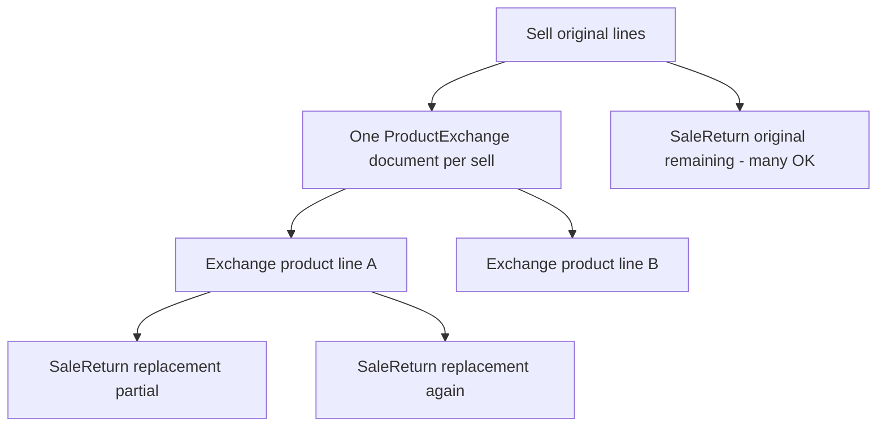

# Sale Return + Product Exchange — Full Plan

**Project:** Coolness Point  
**Status:** Planned (not yet implemented beyond current qty coexistence)  
**Date:** 2026-07-15

---

## 1. Goal

Return এবং Exchange একই sale invoice-এ **qty-level** coexistence থাকবে, calculation ও double-entry accounting ঠিক থাকবে, এবং:

- Exchange-এর **replacement (new) product** Sale Return দিয়ে return করা যাবে (multiple / partial).
- এক sale-এ **একটাই** Product Exchange **document**; তার ভিতরে **multiple product line** exchange করা যাবে.
- দ্বিতীয় exchange document create নয় — পরে শুধু **edit**.

---

## 2. Confirmed business rules



| Rule | Detail |
|------|--------|
| One exchange document | এক sale-এ একটাই `ProductExchange` (INVX)। দ্বিতীয় create blocked; পরে **edit**। |
| Multiple exchange products | ওই এক document-এ **অনেক product line** (কয়েকটা SKU swap / `return_quantity`)। |
| Sale Return (original) | Remaining original qty — multiple INVSR / partial OK। |
| Sale Return (replacement) | New SKU Sale Return দিয়ে — **multiple time / partial** OK যতক্ষণ replacement qty শেষ না হয়। |
| No 2nd exchange doc | `product_exchanges.sell_id` unique থাকবে। |

### What was rejected / reverted during planning

- ~~Mutual exclusion: return হলে exchange নয় / exchange হলে return নয়~~ → **বাতিল**; qty coexistence চাই।
- ~~Multiple Product Exchange documents per sale~~ → **বাতিল**; এক documentই।

---

## 3. Quantity formulas

### Original sell line pool

```
available_original =
  sold
  − Σ SaleReturnProduct.quantity   (where return is against original sell_product)
  − Σ (ProductExchangeProduct.old_quantity + ProductExchangeProduct.return_quantity)
```

Shared helper (already exists):

- [`app/Services/SellProductAvailabilityService.php`](../app/Services/SellProductAvailabilityService.php)
  - `returnedQuantitiesByLine()`
  - `exchangedQuantitiesByLine()`
  - `availableQuantity()`

### Replacement pool (per exchange line)

```
available_replacement =
  ProductExchangeProduct.new_quantity
  − Σ SaleReturnProduct.quantity
    (where product_exchange_product_id = that exchange line)
```

Supports multiple/partial Sale Returns of the same replacement.

### Important meanings

| Field on exchange line | Meaning | Effect on original pool |
|------------------------|---------|-------------------------|
| `old_quantity` | Product **changed** (swap out) | Consumes original |
| `return_quantity` | Refund **without** replacement (from exchange page) | Consumes original |
| `new_quantity` | Replacement SKU issued | Becomes returnable via Sale Return |

Returning a replacement does **not** free the original sold unit back into `available_original` for a new swap of the old SKU (except via exchange **edit** rules).

---

## 4. Current codebase (as of plan)

### Already OK (backend qty)

| Area | Location | Notes |
|------|----------|--------|
| Shared availability | `SellProductAvailabilityService` | Original pool formula |
| Lookup remaining | `SaleLookupController` | Returns `available_quantity`, `exchanged_quantity` |
| SaleReturn store cap | `SaleReturnController` | Uses returned + exchanged |
| Exchange create cap | `ProductExchangeController::processExchangeLines` | Subtracts SaleReturns |
| One exchange per sale | Unique `sell_id` + store/lookup gate | Keep |
| Coexistence tests | `tests/Feature/SaleReturnControllerTest.php` | Partial return→exchange, exchange→return |

### Known gaps to fix

1. **Sale Return UI Available** ignores exchanged qty  
   - [`resources/js/lib/sale-return-summary.js`](../resources/js/lib/sale-return-summary.js) `saleReturnLineStats`  
   - Show: Sold | Returned | Exchanged | Available

2. **Exchange edit** clamps to `sold_quantity` not remaining after returns  
   - [`resources/js/pages/admin/inventory/product-exchange/edit.jsx`](../resources/js/pages/admin/inventory/product-exchange/edit.jsx)

3. **Exchange `edit()` available payload** can overstate max  
   - [`ProductExchangeController::edit`](../app/Http/Controllers/Inventory/ProductExchangeController.php)

4. **Lookup message** — all qty consumed by exchange still says “fully returned”

5. **Overlay money** ignores SaleReturn nets  
   - [`SellExchangeOverlayService`](../app/Services/SellExchangeOverlayService.php) `effectiveNetAmount` / paid / due

6. **Replacement not SaleReturnable yet** — only original `sell_product_id` lines

7. **`excludeExchangeId`** on `processExchangeLines` — wire for edit safety

### Accounting (intended net state)

Assume sell 2 @ 100 cash, no VAT/discount, unit cost C.

**Return 1 then exchange remaining 1 (like-for-like):**  
Sale → SaleReturn (cash + inventory) → Exchange (sales reverse/new + stock out/in).  
Net: kept 1 unit economics; cash ~100 of original 200.

**Exchange 1 then return remaining 1:**  
Same end-state if units don’t overlap (journals order differs).

**Risks to verify with tests:** multi-batch map skew; coin re-redeem after return; special discount edge cases — fix only if tests fail.

---

## 5. Implementation plan

### A) One exchange document, many product lines

- Keep DB unique on `product_exchanges.sell_id`.
- Keep create/lookup gate: “This sale has already been exchanged.”
- Further changes via **edit** only.
- Wire `excludeExchangeId` into `processExchangeLines` on update.
- Create/edit UI: cap each line with `available_quantity` after prior SaleReturns.

### B) Sale Return of replacement (multiple / partial)

**Schema**

- Migration on `sale_return_products`:
  - `product_exchange_product_id` nullable FK → `product_exchange_products`
  - Keep `sell_product_id` for lineage to parent sale line

**Lookup (`SaleLookupController`)**

Return two kinds of lines:

1. Original remaining (today’s payload + exchanged columns)
2. Replacement lines: new product name/code, source exchange invoice, `max_return_quantity = available_replacement`

**Store / update (`SaleReturnController`)**

- Original lines: existing path + availability service
- Replacement lines: restore **new** SKU stock; refund at replacement economics; `postSaleReturn` journal
- Multiple INVSR can each return part of the same replacement until exhausted

**Guards**

- Exchange delete/edit blocked (or constrained) if it would invalidate already-returned replacement quantities unless related SaleReturns are removed first

### C) UI

- Sale Return create/edit:
  - Columns for original: Sold | Returned | Exchanged | Available | Return Qty
  - Section for replacement returnable lines
  - Stats helper uses exchanged / server `available_quantity`
- Exchange edit: same available clamping as create

### D) Overlay & messages

- `effectiveProducts` / net / paid / due: include sale-return nets; strip returned original qty even when no exchange
- Empty pool messages: distinguish fully returned vs fully exchanged vs both

### E) Tests (Pest)

Stock + ledger (+ customer balance where relevant):

1. Sell 2 → Return 1 → Exchange remaining 1  
2. Sell 2 → Exchange 1 → Return original remaining 1  
3. Multi-line exchange in one document  
4. Exchange to new SKU → Sale Return replacement (partial) → second Sale Return of remaining replacement  
5. Second exchange **document** create → blocked  
6. Over-qty reject on original and replacement  
7. Lookup shows `exchanged_quantity` / `available_quantity` correctly  

### F) Residual (only if tests fail)

- Shared batch consumption between return and exchange  
- Coin redeem pool after return + exchange  
- Special discount double-touch  

---

## 6. Implementation order

1. Keep one-doc gates; fix exchange edit availability (multi-line).  
2. Replacement return: migration + lookup + store/update (stock/money).  
3. Sale-return UI (original + replacement, multi-return).  
4. Overlay money + empty-pool messages.  
5. Pest suite; fix proven failures; Pint.

---

## 7. Key files

| File | Role |
|------|------|
| `app/Services/SellProductAvailabilityService.php` | Original qty pool |
| `app/Http/Controllers/Api/SaleLookupController.php` | Lookup for return/exchange UI |
| `app/Http/Controllers/Inventory/SaleReturnController.php` | Sale return create/update |
| `app/Http/Controllers/Inventory/ProductExchangeController.php` | Exchange create/edit |
| `app/Services/SellExchangeOverlayService.php` | Effective sale display/totals |
| `app/Services/InventoryAccountingService.php` | Double-entry posts |
| `app/Services/SaleReturnDiscountService.php` | Return discounts/VAT |
| `app/Services/ProductExchangeDiscountService.php` | Exchange settlement |
| `resources/js/pages/admin/inventory/sale-return/create.jsx` | Return UI |
| `resources/js/pages/admin/inventory/product-exchange/create.jsx` | Exchange create UI |
| `resources/js/pages/admin/inventory/product-exchange/edit.jsx` | Exchange edit UI |
| `resources/js/lib/sale-return-summary.js` | Return line stats |
| `tests/Feature/SaleReturnControllerTest.php` | Feature coverage |

---

## 8. Out of scope

- Multiple **ProductExchange documents** per sale  
- Dropping `sell_id` unique  
- Full rewrite of VAT/special discount engines (unless tests prove wrong money)  
- Returning replacement by creating a second exchange document  

---

## 9. Todo checklist

- [ ] Keep one ProductExchange document per sell; multi-line OK; edit for later changes; wire `excludeExchangeId`
- [ ] Sale Return of replacements (partial/multiple INVSR); `product_exchange_product_id`; stock/refund/accounting for new SKU
- [ ] Sale-return UI: Available/Exchanged + original + replacement lines
- [ ] Exchange create/edit: `available_quantity` clamps; fix edit available payload
- [ ] Fully-consumed lookup messages; overlay money/qty
- [ ] Stock + ledger coexistence tests
- [ ] Fix batch/coin/accounting issues proven by tests; Pint + run suite

---

## 10. Decision log (conversation)

| Decision | Outcome |
|----------|---------|
| Return blocks all exchange / exchange blocks all return | Rejected → qty coexistence |
| Multiple exchange documents | Rejected → one document |
| Multiple products inside one exchange | Allowed |
| Replacement return via Sale Return | Allowed, multiple/partial |
| After exchange, more exchange | Edit only, not new document |
